# AnalaStock

AnalaStock allows users to analyse the performance of historical stock data.
A single stock may be analysed or multiple stocks compared.

The site is aimed at investors and stock market analysts.

Section links
- [Features](#features)
- [Design](#design)
- [Development/Local Deployment](#developmentlocal-deployment)
- [Testing](#testing)
- [Cloud-based Deployment](#cloud-based-deployment)
- [Enhancements](#enhancements)
- [Credits](#credits)

## Features 
### Menu
The application is menu-driven.

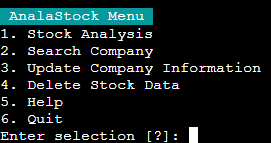

### Navigation
The primary method of navigation is via menu option selection.
In addition, it is possible to navigate back one step using the `/` key, or return to the main menu using the `!!` combination. 

| Back                                     | Goto Main Menu                           |
|------------------------------------------|------------------------------------------|
| 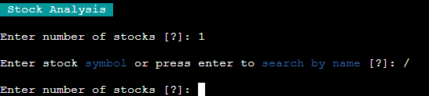 | 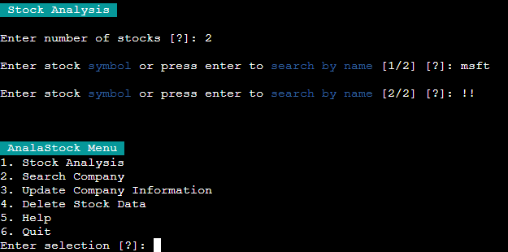 |

### Search
Companies may be search for by entering the company name or part thereof in the `Search Company` option.
The results are displayed in a menu, multi-page if necessary, allowing selection of a specific stock listing for the company.
E.g. `MSF.BE` is Microsoft Corporation traded on the Berlin Stock Exchange, and `MSF.BR` is Microsoft Corporation traded on the Brussels Stock Exchange. 

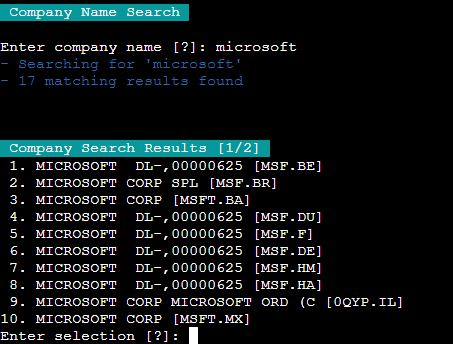

### Stock Analysis
#### Analysis Stock Selection
Up to 3 stock may be analysed simultaneously.

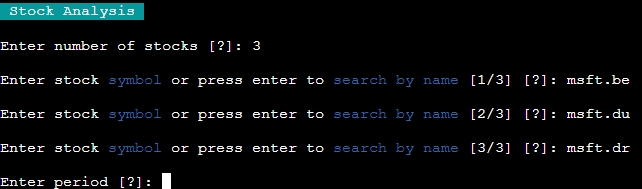

#### Period Entry
There are multiple methods of entering the analysis period.

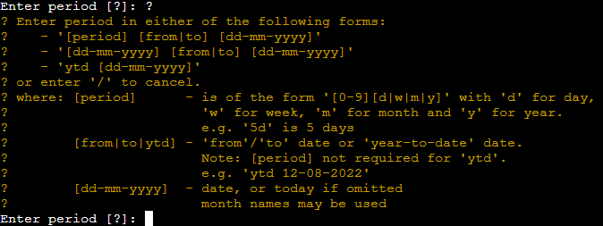

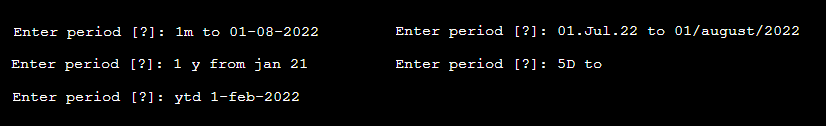

#### Ambiguous Dates
Period entry detects ambiguous dates and prompts the user to resolve the issue.

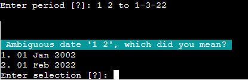

#### Analysis Results
The analysis results are displayed in tabular form.
The minimum, maximum, average, change and percent change values are listed for 
* Opening price
* High price
* Low price
* Close<sup>*</sup> price
* Adjusted Close<sup>**</sup> price
* Volume

<sup>*</sup> Close price adjusted for splits<br>
<sup>**</sup> Adjusted close price adjusted for splits and dividend and/or capital gain distribution

##### Single Stock Analysis Results
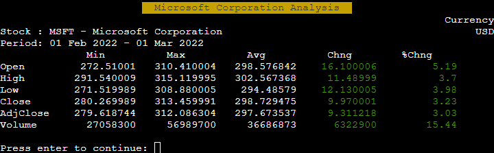

##### Multi-Stock Analysis Results
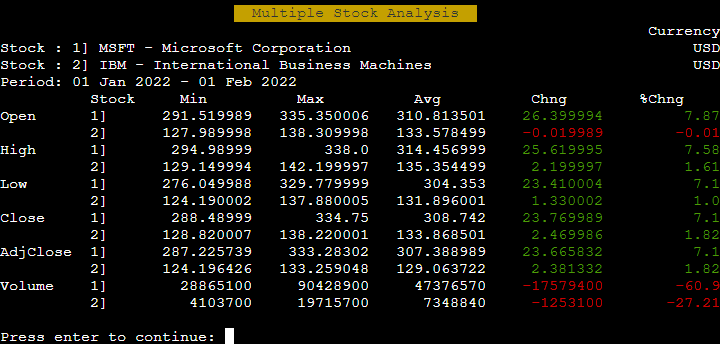

### Help
#### Paginated Help
The application provides a paginated help section accessed from the main menu, detailing the use of the application 

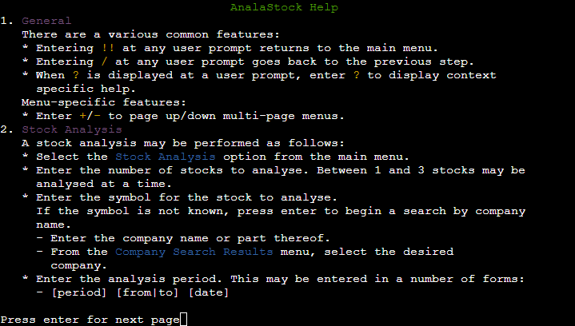

#### Context-specific Help
Whenever the `[?]` is displayed at a user prompt, context-specific help is accessible by entered `?`.

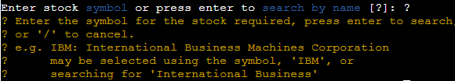

### Data
### Data Storage
Downloaded Company Data along with historical financial data is stored in Google Sheets.

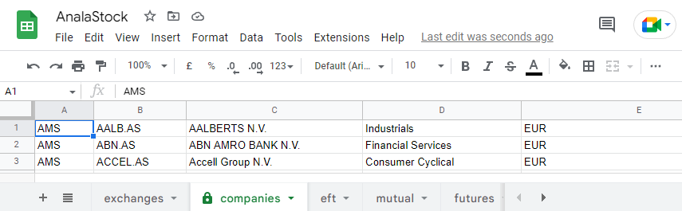

See [Data Storage](doc/design/design.md#data-storage) for details.

### Company Data Update
As the provider of the company data, [YahooFinance Stocks](https://rapidapi.com/integraatio/api/yahoofinance-stocks1/) 
from [RapidAPI](https://rapidapi.com/) does not guarantee that the company data is up-to-date, it is possible to update the stored company data.

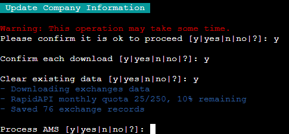

### Delete Stock Data
It is also possible to delete stored historical stock data.

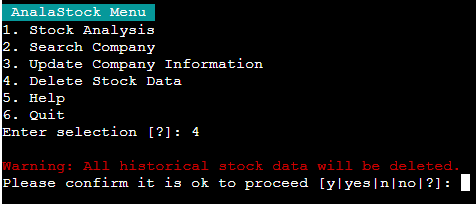


## Design
The design specification is available in [design.md](doc/design/design.md).

## Development/Local Deployment
### Environment
The development environment requires:

| Artifact                                       | Download and installation instructions               |
|------------------------------------------------|------------------------------------------------------|
| [Node.js](https://nodejs.org/)                 | https://nodejs.org/en/download/                      |
| [npm](https://www.npmjs.com/)                  | Included with Node.js installation                   |
| [git](https://git-scm.com/)                    | https://git-scm.com/downloads                        |
| [Python](https://www.python.org/)              | https://www.python.org/downloads/                    |
| [Total.js framework](https://www.totaljs.com/) | Installed during [Framework Setup](#framework-setup) |

### Setup
#### Clone Repository
In an appropriate folder, run the following commands:
```shell
> git clone https://github.com/ibuttimer/analastock.git
> cd analastock
```

#### Virtual Environment
It is recommended that a virtual environment be used for development purposes.
Please see [Creating a virtual environment](https://packaging.python.org/guides/installing-using-pip-and-virtual-environments/#creating-a-virtual-environment) for details.

> __Note:__ Make sure to [activate the virtual environment](https://packaging.python.org/en/latest/guides/installing-using-pip-and-virtual-environments/#activating-a-virtual-environment).

#### Framework Setup
In the `analastock` folder, run the following command to setup the [Total.js](https://www.totaljs.com/) framework:
```shell
> npm install
```

#### Python Setup
In the `analastock` folder, run the following command to install the necessary python packages:
```shell
> pip install -r requirements-dev.txt
```
#### Production versus Development Setup
Installing the requirements from [requirements-dev.txt](requirements-dev.txt) installs extra development-only requirements in addition to the production requirements from [requirements.txt](requirements.txt).

### Configuration
The application configuration may be set using using environment variables or a configuration file.

#### Credentials

##### Google Drive API

* On the [Google Cloud Platform](https://console.cloud.google.com/), click on the `Select a project` button and then select `New Project`
* Give the project a name and click `Create`
* Once created click `Select Project` on the notification or select the project from the `Select a project` modal.
* From the sidebar menu select `APIs and service -> Library`
* Search for the `Google Drive API`, click on the entry on the results and enable it.
* Once enabled, click on the `Credentials` in the sidebar
* Select the `Create Credentials->Help Me Choose` option
* From the `Which API are you using?` dropdown menu, choose `Google Drive API`
* Select `Application Data` as the answer to `What data will you be accessing?` 
* Select `No, I'm not using them` for the `Are you planning to use this API with Compute Engine, Kubernetes Engine, App Engine, or Cloud Functions?` question, click Next
* Enter a Service Account name under `Service account details` and click `Create and Continue`
* Under `Grant this service account access to the project`, select `Basic -> Editor` from the Role Dropdown box, and click Continue
* Click Done at the bottom of the page
* Once the service account is created, click on the account entry in the `Service Accounts` list
* Select the `Keys` tab, and `Create new key` from the `Add Key` dropdown
* Select `JSON` as the key type and click create.
* Store the downloaded file safely as it contains the credentials need to access the Google API
* For a local deployment, use the `GOOGLE_CREDS_FILE` and `GOOGLE_CREDS_PATH` [configuration settings](#table-1-configuration-settings) to specify the location of the file in the application.
* Or for a Heroku deployment, set the value of the `GOOGLE_CREDS` config variable to the contents of the file

##### RapidAPI
[RapidAPI](https://rapidapi.com/) is used to retrieve stock exchange and company information.

- Sign up or log in on the [RapidAPI home page](https://rapidapi.com/)
- In the [API hub](https://rapidapi.com/hub), select the [Finance](https://rapidapi.com/category/Finance) category
- Select the [YahooFinance Stocks](https://rapidapi.com/integraatio/api/yahoofinance-stocks1/) API
- Select the `Subscribe to Test` option
- Select the `Basic` plan and enter payment card details
- Once subscribed, the API credentials may be retrieved by selecting `Python (Requests)` under `Code Snippets`, and copying the JSON for the `headers` variable
- For a local deployment, save the credentials to a file, and use the `YAHOO_FINANCE_CREDS_FILE` and `YAHOO_FINANCE_CREDS_PATH` [configuration settings](#table-1-configuration-settings) to specify the location of the file in the application.
- Or for a Heroku deployment, set the value of the `YAHOO_FINANCE_CREDS` config variable to the credentials
  ```python
  {
    "X-RapidAPI-Key": "this-is-the-api-key",
    "X-RapidAPI-Host": "yahoofinance-stocks1.p.rapidapi.com"
  }
  ```

#### Configuration file
Create a file named `.env` in the project root folder, see [.sample-env](.sample-env). The following variables may be set:

###### Table 1: Configuration settings
| Key                      | Value                                                                                                                                                                                                                                                                                       |
|--------------------------|---------------------------------------------------------------------------------------------------------------------------------------------------------------------------------------------------------------------------------------------------------------------------------------------|
| PORT                     | Port application is served on; default 8000                                                                                                                                                                                                                                                 |
| NODE_ENV                 | Set to 'production' or 'development', see [Node.js, the difference between development and production](https://nodejs.dev/learn/nodejs-the-difference-between-development-and-production)                                                                                                   |
| PYTHON_PATH              | Path to python executable; default ''.<br>__Note:__ if a relative path is specified, it must be relative to the project root folder. E.g. if using a [venv virtual environment](https://docs.python.org/3/library/venv.html#module-venv) in the project root folder, use `./venvd/Scripts/` |
| PYTHON_EXE               | Python executable; default 'python3'.<br>__Note:__ If running on windows, full filename including extension is required, e.g. 'python.exe'                                                                                                                                                  |
| APP_PATH                 | Path to app folder; default '/app'.<br>__Note:__ if a relative path is specified, it must be relative to the project root folder. E.g. the default location is the project root folder, so use `CREDS_PATH`                                                                                 |
| GOOGLE_CREDS             | Google Drive API credentials                                                                                                                                                                                                                                                                |
| GOOGLE_CREDS_FILE        | Name of name of Google Drive API credentials file; default `google_creds.json`                                                                                                                                                                                                              |
| GOOGLE_CREDS_PATH        | Path to Google Drive API credentials file; default `./`<br>__Note:__ must be relative to the project root folder                                                                                                                                                                            |
| YAHOO_FINANCE_CREDS      | [RapidAPI](https://rapidapi.com/) [YahooFinance Stocks](https://rapidapi.com/integraatio/api/yahoofinance-stocks1/) credentials                                                                                                                                                             |
| YAHOO_FINANCE_CREDS_FILE | Name of name of [RapidAPI](https://rapidapi.com/) [YahooFinance Stocks](https://rapidapi.com/integraatio/api/yahoofinance-stocks1/) credentials file; default `yahoo_finance_creds.json`                                                                                                    |
| YAHOO_FINANCE_CREDS_PATH | Path to [RapidAPI](https://rapidapi.com/) [YahooFinance Stocks](https://rapidapi.com/integraatio/api/yahoofinance-stocks1/) credentials file; default `./`<br>__Note:__ must be relative to the project root folder                                                                         |
| GOOGLE_READ_QUOTA        | Google Sheets API: Read requests per minute per user quota; default `60`                                                                                                                                                                                                                    |
| GOOGLE_WRITE_QUOTA       | Google Sheets API: Write requests per minute per user; default `60`                                                                                                                                                                                                                         |
| RAPIDAPI_READ_QUOTA      | RapidAPI: Requests per minute; default `50`                                                                                                                                                                                                                                                 |
| MAX_BACKOFF              | Max backoff time in seconds for truncated exponential backoff retry; default `128`                                                                                                                                                                                                          |
| HELP_PATH                | Path to help file; default `./doc/help.txt`<br>__Note:__ must be relative to the project root folder                                                                                                                                                                                        |
| DATA_PATH                | Path to sample data folder; default `./data`<br>__Note:__ must be relative to the project root folder                                                                                                                                                                                       |
| SPREADSHEET_NAME         | Name of Google Sheets spreadsheet                                                                                                                                                                                                                                                           |
| LOGGING                  | Enable console log messages; set to `0` or `1`                                                                                                                                                                                                                                              |

#### Environment variables
Set environment variables corresponding to the keys in [Table 1: Configuration settings](#table-1-configuration-settings).

E.g.
```shell
For Linux and Mac:                       For Windows:
$ export NODE_ENV=development            > set NODE_ENV=development
```

### Application structure
The application structure is split in two; a [Total.js](https://www.totaljs.com/) application which hosts the console, and a [Python](https://www.python.org/) application which provides the application logic.

```
├─ README.md            - this file
├─ doc                  - documentation
│  ├─ help.txt          - help text
│  ├─ design            - design related documentation
│  └─ utils_tests       - utility tests
│ [------------ Total.js application ------------]
├─ index.js             - application entry point
├─ controllers          - JavaScript controllers
├─ public               - application assets
│  └─ img               - image files
├─ views                - views html files
│ [------------  Python application  ------------]
├─ run.py               - Python application entry point
├─ data                 - sample data files
├─ process              - process-related functions
├─ sheets               - Google sheets-related functions
├─ stock                - stock-related functions
├─ tests                - test scripts
│  ├─ sheets_tests      - Google sheets-related tests
│  ├─ stock_tests       - stock tests
│  └─ utils_tests       - utility tests
└─ utils                - utility functions
```

### Potential Visual Studio Code issues
- Invalid message: Duplicate entries in "env"

    Please see [Debugging test in VS Code does not work](https://github.com/microsoft/vscode-python/issues/10722)

- 'EOFError: EOF when reading a line' when reading input in "DEBUG CONSOLE"

  Please see [EOF Error on 1st line](https://stackoverflow.com/a/64236008) and [Python debugging in VS Code](https://code.visualstudio.com/docs/python/debugging#_console)

## Testing 
Details of the testing undertaken are outlined in [test.md](doc/test/test.md), along with the results.

## Cloud-based Deployment

The site was deployed on [Heroku](https://www.heroku.com).

The following steps were followed to deploy the website: 
  - Login to Heroku
  - From the dashboard select `New -> Create new app`
  - Set the value for `App name`, choose the appropriate region and click `Create app`
  - From the app settings, select the `Settings` tab.
    - Under `Buildpacks` add the following buildpacks
      1. `heroku/python`
      1. `heroku/nodejs`
    - Under `Config Vars` add the following environment variables

      | Key                 | Value                                                                                                                           |
      |---------------------|---------------------------------------------------------------------------------------------------------------------------------|
      | PORT                | 8000                                                                                                                            |
      | GOOGLE_CREDS        | Google Drive API credentials                                                                                                    |
      | YAHOO_FINANCE_CREDS | [RapidAPI](https://rapidapi.com/) [YahooFinance Stocks](https://rapidapi.com/integraatio/api/yahoofinance-stocks1/) credentials |

      See [Table 1: Configuration settings](#table-1-configuration-settings) for details.

      If any other settings vary from the defaults outlined in [Table 1: Configuration settings](#table-1-configuration-settings) they must be added as well.

  - From the app settings, select the `Deploy` tab.
    - For the `Deployment method`, select `GitHub` and link the Heroku app to the GitHub repository.

      __Note:__ To configure GitHub integration, you have to authenticate with GitHub. You only have to do this once per Heroku account. See [GitHub Integration (Heroku GitHub Deploys)](https://devcenter.heroku.com/articles/github-integration).
    - `Enable Automatic Deploys` under `Automatic deploys` to enable automatic deploys from GitHub following a GitHub push if desired.
    - The application may also be deployed manually using `Deploy Branch` under `Manual deploy`

The live website is available at [https://analastock.herokuapp.com/](https://analastock.herokuapp.com/)

## Enhancements

Enhancements were logged in [GitHub Issues](https://github.com/ibuttimer/analastock/labels/enhancement).

| Title                               | Description                                      |
|-------------------------------------|--------------------------------------------------|
| Context-specific help               | https://github.com/ibuttimer/analastock/issues/1 |
| Help search                         | https://github.com/ibuttimer/analastock/issues/2 |
| Training/demo mode                  | https://github.com/ibuttimer/analastock/issues/3 |
| Add logging                         | https://github.com/ibuttimer/analastock/issues/4 |
| Additional period entry descriptors | https://github.com/ibuttimer/analastock/issues/5 |

## Credits

The following resources were used to build the website.

### Content

- The favicon for the site was generated by [RealFaviconGenerator](https://realfavicongenerator.net/) from [graph image](https://lineicons.com/icons/?search=graph&type=free) by [Lineicons](https://lineicons.com/)
