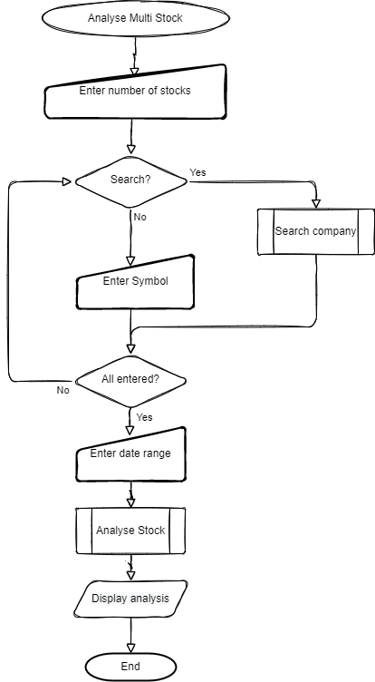
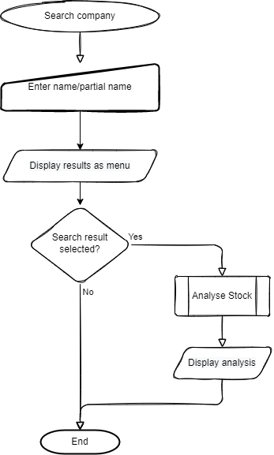

# Strategy
The strategy is to create a website allowing the user to retrieve historical stock data for analysis.

The target audience for the application are investors. The site will provide them with insight into the performance of stocks they have invested in, or are considering investing in.

# Scope
The scope of the project will be to allow the user to:
- Specify the symbol of the stock for analysis
- Specify the date range of the historical data to analyse
- Specify the symbols for multiple stocks to compare


## User Stories
As a user:
- I want to understand the purpose of the site.
- I want to be able to specify the stock to analyse.
- I do not want to analyse stock indices, such as the Dow Jones Industrial Average.
- I want to be able to specify the date range to analyse.
- I want to be able to view the statistics for stock analysed, including but not limited
  - min/max opening price
  - min/max high price
  - percentage gain/loss
- I want to have a menu to use
- I want to be able to compare multiple stocks against each other
- I want the analysis data to be easily understood, with important data colour highlighted
- I want to know what currency used for the data
- I want to be able to search for stock symbols

As the site administrator:
- I want to minimise the download of data from external websites
- I aggregate previously downloaded and required data to meet user needs
- I want to use [Yahoo Finance](https://finance.yahoo.com/) to stock data
- I want to use [RapidAPI](https://rapidapi.com/) is used to retrieve stock exchange and company information
- I want to use Google APIs to access and store downloaded data

# Structure

# Skeleton
The website will consist of a single page.

# General layout
A console terminal will be used for user input and analysis display purposes.

# Wireframes
Wireframes of page layouts are as followings:

## Home page

The Home page will have the following features:
- 80 x 24 character terminal console
- Run Program button


# UX Surface
## Font
The font used for console text will be Courier.

## Colour Scheme

The console text will be white on a black background.

## UX Elements

### Menu
The application menu will display a list of possible options, allowing the user to select an option by inputting the corresponding option number.

#### Menu Structure
- _Stock Analysis_

    Access stock analysis menu

  - _Single stock_

    Analyse single stock

  - _Multiple stock_

    Analyse multiple stocks

- _Search Company_

    In-app search for company information

- _Update Company Information_

    Update the in-app company information

- _Quit_

    Quit the application

### Screen Layout

#### Analysis Result (Single Company)
##### Data available
```
80 Columns
12345678901234567890123456789012345678901234567890123456789012345678901234567890

                                                                       Currency
Stock : IBM - International Business Machines Corporation                   USD
Period: 01 Mar 2022 - 01 Jul 2022
              Min          Max          Avg         Change         % 
Open      ............ ............ ............ ............ ............
Low       ............ ............ ............ ............ ............   
High      ............ ............ ............ ............ ............   
Close     ............ ............ ............ ............ ............   
AdjClose  ............ ............ ............ ............ ............       
Volume    ............ ............ ............ ............ ............     
```

##### Missing Data
In the event that it was not possible to retrieve data for the full range requested, this will be highlight as follows:
```
80 Columns
12345678901234567890123456789012345678901234567890123456789012345678901234567890

                                                                       Currency
Stock : IBM - International Business Machines Corporation                   USD
Period: 01 Mar 2022* - 01 Jul 2022**
              Min          Max          Avg         Change         % 
Open      ............ ............ ............ ............ ............
Low       ............ ............ ............ ............ ............
High      ............ ............ ............ ............ ............
Close     ............ ............ ............ ............ ............
AdjClose  ............ ............ ............ ............ ............
Volume^   ............ ............ ............ ............ ............

* : Data n/a 05 Jun 2003 - 28 Feb 2022
**: Data n/a 02 Jul 2003 - 29 Jul 2022
^ : Data missing
```

#### Analysis Result (Multiple Companies)
##### Data available
```
80 Columns
12345678901234567890123456789012345678901234567890123456789012345678901234567890

                                                                       Currency
1] Stock : MSFT    - Microsoft Corporation                                  USD
   Period: 01 Mar 2022 - 01 Jul 2022
2] Stock : MSFT.NE - Microsoft Corporation                                  CAD
   Period: 01 Mar 2022 - 01 Jul 2022
3] Stock : MSFT.MX - Microsoft Corporation                                  MXN
   Period: 01 Mar 2022 - 01 Jul 2022
          Stock    Min          Max          Avg         Change         % 
Open      1]   ............ ............ ............ ............ ............
          2]   ............ ............ ............ ............ ............
          3]   ............ ............ ............ ............ ............
Low       1]   ............ ............ ............ ............ ............
          2]   ............ ............ ............ ............ ............
          3]   ............ ............ ............ ............ ............
High      1]   ............ ............ ............ ............ ............
          2]   ............ ............ ............ ............ ............
          3]   ............ ............ ............ ............ ............
Close     1]   ............ ............ ............ ............ ............
          2]   ............ ............ ............ ............ ............
          3]   ............ ............ ............ ............ ............
AdjClose  1]   ............ ............ ............ ............ ............
          2]   ............ ............ ............ ............ ............
          3]   ............ ............ ............ ............ ............
Volume    1]   ............ ............ ............ ............ ............
          2]   ............ ............ ............ ............ ............
          3]   ............ ............ ............ ............ ............
```

##### Missing Data
In the event that it was not possible to retrieve data for the full range requested, this will be highlight as follows:
```
80 Columns
12345678901234567890123456789012345678901234567890123456789012345678901234567890

                                                                       Currency
1] Stock : MSFT    - Microsoft Corporation                                  USD
   Period: 01 Mar 2022* - 01 Jul 2022
2] Stock : MSFT.NE - Microsoft Corporation                                  CAD
   Period: 01 Mar 2022 - 01 Jul 2022**
3] Stock : MSFT.MX - Microsoft Corporation                                  MXN
   Period: 01 Mar 2022* - 01 Jul 2022
          Stock    Min          Max          Avg         Change         % 
Open      1]   ............ ............ ............ ............ ............
          2]   ............ ............ ............ ............ ............
          3]   ............ ............ ............ ............ ............
Low       1]   ............ ............ ............ ............ ............
          2]   ............ ............ ............ ............ ............
          3]   ............ ............ ............ ............ ............
High      1]   ............ ............ ............ ............ ............
          2]   ............ ............ ............ ............ ............
          3]   ............ ............ ............ ............ ............
Close     1]   ............ ............ ............ ............ ............
          2]   ............ ............ ............ ............ ............
          3]   ............ ............ ............ ............ ............
AdjClose  1]   ............ ............ ............ ............ ............
          2]   ............ ............ ............ ............ ............
          3]   ............ ............ ............ ............ ............
Volume    1]   ............ ............ ............ ............ ............
          2]^  ............ ............ ............ ............ ............
          3]   ............ ............ ............ ............ ............

* : 1] Data n/a 05 Jun 2003 - 28 Feb 2022
  : 3] Data n/a 05 Jun 2003 - 28 Feb 2022
**: 2] Data n/a 02 Jul 2003 - 29 Jul 2022
^ : Data missing
```

## UX Flow Chart

## Stock Analysis
The flow chart of the analysis of a stock is as follows:


## Single Stock Analysis
The flow chart of the analysis of stock is as follows:

| Single | Multiple |
|--------|----------|
|||

## Company Search
The flow chart of the search for a company is as follows:




# Data
## Data Source
The financial data for analysis will be downloaded from [Yahoo Finance](https://finance.yahoo.com/).
Specifically the data used will the `Historical Prices` data provided by [Yahoo Finance](https://finance.yahoo.com/).

The following input will be required from the user:

| Input | Description |
|-------|-------------|
| Symbol | The Yahoo Finance stock exchange symbol used for the stock.<br>Symbols may be found by searching on [Yahoo Finance](https://finance.yahoo.com/) or by using the in-app search functionality. E.g. the symbol for Microsoft Corporation on the [NASDAQ](https://www.nasdaq.com/) Global Select Market is `MSFT`, and for the [NEO Exchange](https://www.neo.inc/) is `MSFT.NE` |
| From date | The data for the start of analysis<br>__Note:__ The minimum date in 1st Feb. 1962. |
| To date | The data for the end of analysis<br>__Note:__ This is date is not included in the analysis. |

## Data Storage
Data will be stored in a Google Sheets spreadsheet.

### Stock Data
Stock data will be organised as follows:
- The data for each stock will be stored in an individual worksheet
- The stock symbol will be used as the worksheet name
- The following data will be stored:

    | Name | Type | Description |
    |------|------|-------------|
    | Date | Date | Date of data |
    | Open | Float | Opening price |
    | High | Float | High price |
    | Low  | Float | Low price |
    | Close | Float | Closing price<br>__Note:__ Close price adjusted for splits. |
    | Adj Close | Float | Adjusted Closing price<br>__Note:__ Adjusted close price adjusted for splits and dividend and/or capital gain distributions. |
    | Volume | Integer | Opening price |

### Exchanges Data
Exchanges data will be stored in an individual worksheet.
The following data will be stored:

| Data | Description |
|------|-------------|
| Exchange code | Exchange code |
| Name | Name of exchange |

### Companies Data
Companies data will be stored in an individual worksheet.
The following data will be stored:

| Data | Description |
|------|-------------|
| Exchange code | Exchange code |
| Stock symbol | Symbol used on [Yahoo Finance](https://finance.yahoo.com/) |
| Name | Name of company |
| IndustryOrCategory | Industry or category of the company |
| Currency | Stock currency |
